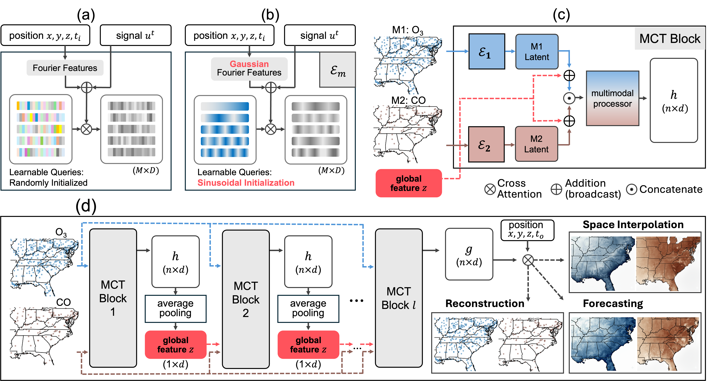
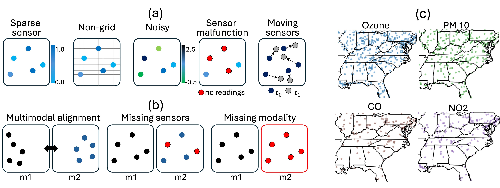
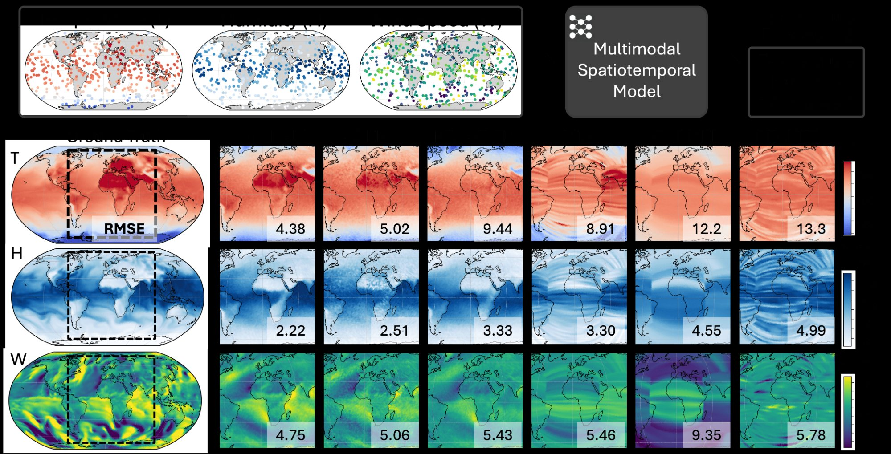
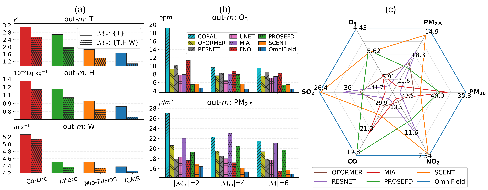
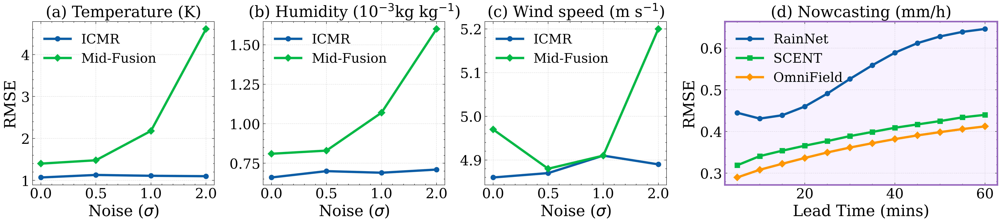

# OmniField: Conditioned Neural Fields for Robust Multimodal Spatiotemporal Learning

**Published as a conference paper at ICLR 2026**

[Paper](https://openreview.net/forum?id=XXXX) • [arXiv](https://arxiv.org/abs/XXXX)

Kevin Valencia<sup>1</sup>, Thilina Balasooriya<sup>2</sup>, Xihaier Luo<sup>3</sup>, Shinjae Yoo<sup>3</sup>, David Keetae Park<sup>3</sup>

<sup>1</sup>UCLA &nbsp; <sup>2</sup>Columbia University &nbsp; <sup>3</sup>Brookhaven National Laboratory

---

<p align="center">
  
</p>

## Overview

OmniField is a continuity-aware framework that learns a continuous neural field conditioned on available modalities and iteratively fuses cross-modal context. It addresses two key challenges in multimodal spatiotemporal learning:

- **Data challenge**: measurements are sparse, irregular, and noisy with QA/QC artifacts
- **Modality challenge**: the set of available modalities varies across space and time

<p align="center">
  
</p>

### Key contributions

- **Multimodal Crosstalk (MCT)** block for cross-modal information exchange
- **Iterative Cross-Modal Refinement (ICMR)** that progressively aligns signals across modalities
- **Fleximodal Fusion** enabling operation on any subset of input modalities without retraining
- **22.4%** average relative error reduction across benchmarks vs. 8 strong baselines
- Near-clean performance under heavy simulated sensor noise

## Results

### ClimSim-THW Qualitative Forecasting (Δt = 6h)

<p align="center">
  
</p>

### Baseline Comparisons & EPA-AQS

<p align="center">
  
</p>

### Robustness to Noisy Sensors

<p align="center">
  
</p>

## Installation

```bash
git clone https://github.com/kevinval04/OmniField.git
cd omnifield
pip install -r requirements.txt
```

### Requirements

- Python ≥ 3.8
- PyTorch ≥ 2.0
- einops, netCDF4, cosine-annealing-warmup, tqdm, numpy, xarray

## Data Preparation

### ClimSim-THW

1. **Download** the first 10,000 snapshots from [ClimSim High-Res](https://huggingface.co/datasets/LEAP/ClimSim_high_res):

```bash
python scripts/download_climsim.py
```

This downloads and extracts temperature (`state_t`), humidity (`state_q0001`), and wind speed (`state_v`) at vertical level 59, saving compressed `.npz` files to `processed/`.

2. **Grid metadata**: download `ClimSim_high-res_grid-info.nc` from the same HuggingFace dataset and place it in the repo root.

3. **Normalization stats**: `norm_TQV_full.npz` contains pre-computed per-modality (mean, std). This file is included in the repo.

### EPA-AQS

Download from the [EPA AQS Data Mart](https://www.epa.gov/aqs). We use records from 1987–2017 across six modalities (O₃, PM₂.₅, PM₁₀, NO₂, CO, SO₂) parsed by calendar day.

## Training

```bash
python train.py \
    --data_dir ./processed \
    --grid_meta ClimSim_high-res_grid-info.nc \
    --norm_stats norm_TQV_full.npz \
    --device cuda:0 \
    --batch_size 8 \
    --total_iters 100000 \
    --max_lr 8e-5 \
    --save_path checkpoints/best_model.pt
```

All hyperparameters match those reported in Appendix A of the paper. Training was performed on a single NVIDIA H100 80GB GPU.

## Evaluation

```bash
python evaluate.py \
    --checkpoint checkpoints/best_model.pt \
    --data_dir ./processed \
    --grid_meta ClimSim_high-res_grid-info.nc \
    --norm_stats norm_TQV_full.npz
```

Reports per-modality MSE (normalized) and RMSE in physical units (K, 10⁻³ kg/kg, m/s).

## Repository Structure

```
omnifield/
├── README.md
├── LICENSE
├── requirements.txt
├── .gitignore
├── norm_TQV_full.npz              # Pre-computed normalization stats
├── train.py                       # Training script (ClimSim-THW)
├── evaluate.py                    # Evaluation script
├── omnifield/
│   ├── __init__.py
│   ├── model.py                   # OmniField architecture (GFF, MCT, ICMR, decoders)
│   └── data/
│       ├── __init__.py
│       └── climsim.py             # ClimSim-THW dataset with Venn sensor partition
├── baselines/                     # Baseline model architectures used for comparison
│   ├── fno.py                     # Fourier Neural Operator
│   ├── resnet.py                  # ResNet-1D
│   ├── scent.py                   # SCENT (Perceiver-based CNF)
│   ├── mia.py                     # MIA (Multimodal Iterative Adaptation)
│   ├── unet.py                    # UNet
│   ├── oformer.py                 # OFormer
│   └── prosefd.py                 # PROSE-FD
├── scripts/
│   └── download_climsim.py        # Download & preprocess ClimSim data
└── assets/                        # Figures for README
```

## Citation

If you find this work useful, please cite:

```bibtex
@inproceedings{valencia2026omnifield,
  title     = {OmniField: Conditioned Neural Fields for Robust Multimodal Spatiotemporal Learning},
  author    = {Valencia, Kevin and Balasooriya, Thilina and Luo, Xihaier and Yoo, Shinjae and Park, David Keetae},
  booktitle = {International Conference on Learning Representations (ICLR)},
  year      = {2026}
}
```

## Acknowledgements

This work was supported by the U.S. Department of Energy (DOE), Office of Science, Advanced Scientific Computing Research program under award DE-SC-0012704 and used resources of the National Energy Research Scientific Computing Center (NERSC award DDR-ERCAP0030592).

## License

This project is licensed under the MIT License — see [LICENSE](LICENSE) for details.
